# 🐧 B1 Linux - TP2

## I. Exploration locale en solo

### 1. Affichage d'informations sur la pile TCP/IP locale

#### 📟 En ligne de commande

##### a) Affichage des informations des cartes réseau

Avec la commande : `ipconfig /all`

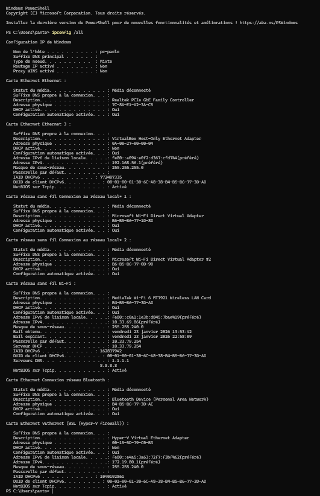

**Récapitulatif des interfaces :**

| Interface | Adresse MAC | Adresse IP |
|-----------|-------------|------------|
| WiFi | B4-B5-B6-77-3D-AD | 10.33.69.86 |
| Ethernet | 70-8B-CD-A2-3A-C5 | / |

##### b) Affichage de la gateway

Commande utilisée : `ipconfig | findstr /i "passerelle Wi-Fi"`

**Résultat :** `10.33.79.254`

#### 🖥️ En graphique (GUI)

Pour accéder aux informations réseau : Paramètres → Réseau et Internet → WiFi

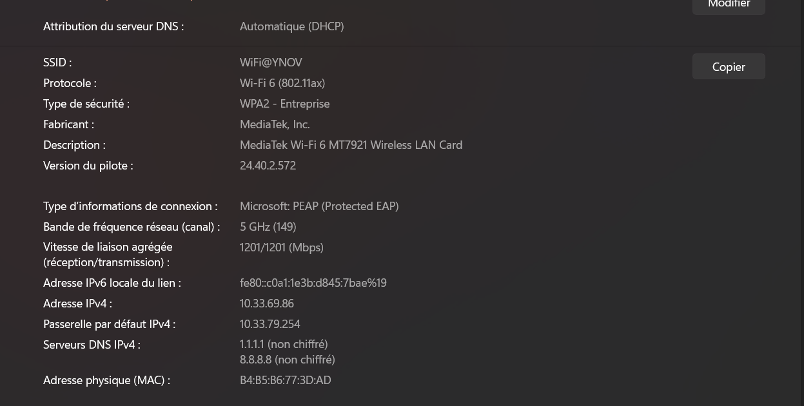

**💡 Quel est le rôle de la gateway dans le réseau d'Ingésup ?**

La gateway (passerelle) joue plusieurs rôles essentiels :
- **Pont vers Internet** : c'est la porte de sortie du réseau local
- **Routage inter-réseaux** : permet la communication entre différents réseaux
- **Sécurité et filtrage** : contrôle et filtre les contenus et sites web
- **Centralisation** : point central pour la gestion de l'accès Internet

#### 2. Modifications des informations
_a) Modification d'adresse IP - pt. 1_
- Calcul des ip dispo 
        - donc avec notre adresse ip = 10.33.69.86 et notre Gateway : 10.33.79.254

| 10.33.69.86  | 255.255.240.0   | 
| -------- | -------- |
| 00001010.00100001.01000101.01010110     | 11111111.11111111.11110000.00000000     |

Si on fait le calcul on retrouve :10.33.64.0 = 00001010.00100001.01000000.00000000

En faisant l’ET logique entre l’adresse IP et le masque, on obtient l’adresse de réseau :

Adresse de réseau : 10.33.64.0

Adresse broadcast : 10.33.79.255

Première IP disponible : 10.33.64.1

Dernière IP disponible : 10.33.79.254

- pour le changement d'ip : parametre -> réseaux et internet -> wifi

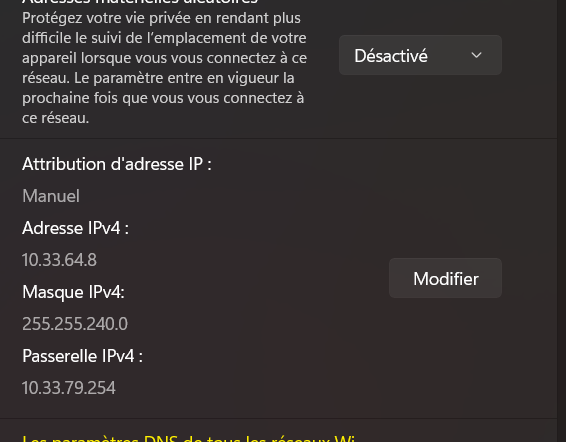

J'ai choisis une ip qui était
libre et remplis les autres infos 

_b)nmap_
J'installe nmap et je tape cette commande qui va scanner le réseau
nmap -sn -PE 10.33.64.0/20
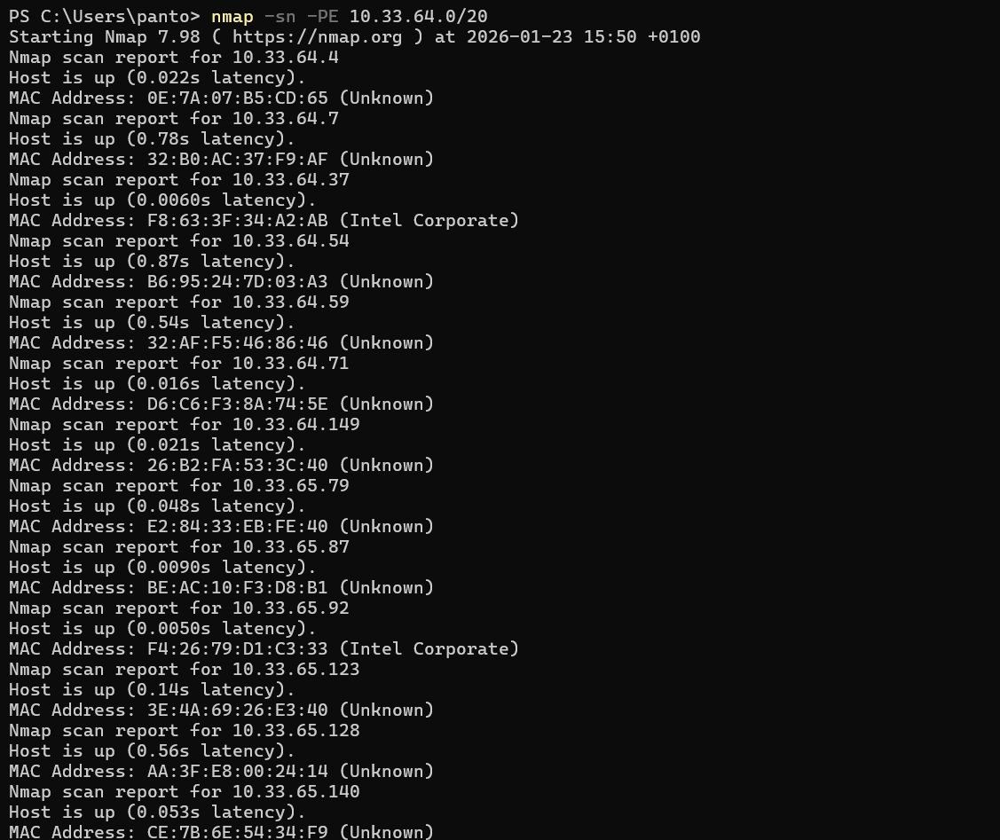

_c) Modification d'adresse IP - pt. 2_
On a donc une ip en .120 qui est libre alors je m'y connecte
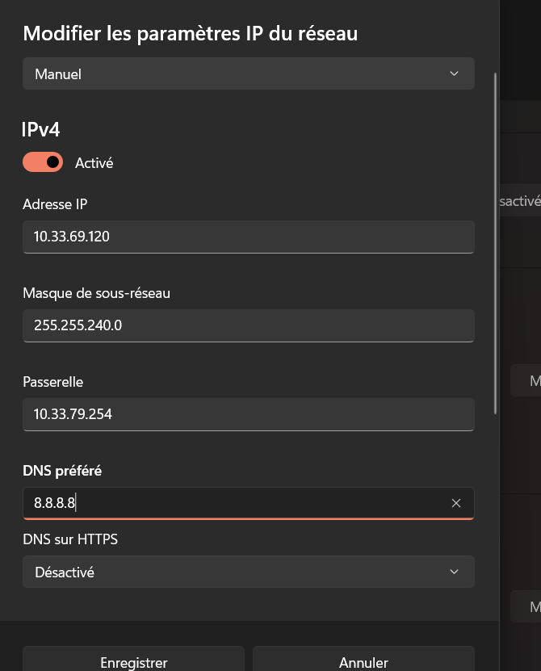
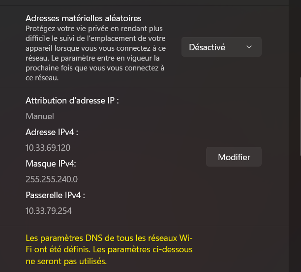
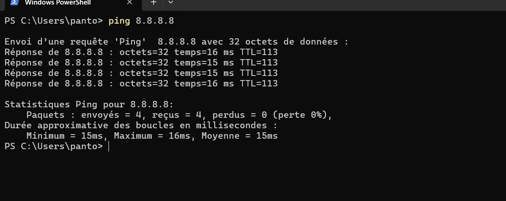
### On a pu ping alors on va tester sur un navigateur

### youtube marche alors c'est bon

### III. Manipulations d'autres outils/protocoles côté client

_1) DHCP_

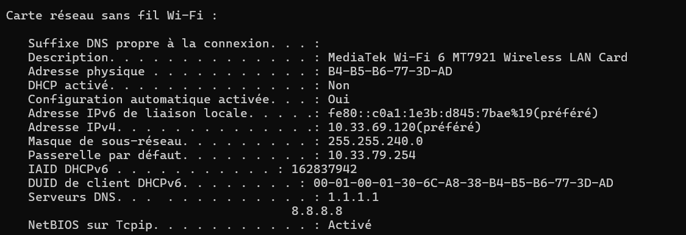
Je remarque que le DHCP n'est pas activé 
Sur le réseau Ingésup, l’attribution des adresses IP est normalement effectuée automatiquement par un serveur DHCP.
Lors de la configuration initiale, une adresse IP a été attribuée dynamiquement par le serveur DHCP du réseau.
Adresse du serveur DHCP : 10.33.79.254
Le DHCP attribue une adresse IP pour une durée limitée appelée bail DHCP. À l’expiration de ce bail, l’ordinateur doit renouveler son adresse IP ou en obtenir une nouvelle.
Dans la configuration actuelle, la carte WiFi est configurée en adresse IP statique, le DHCP est donc désactivé.
Les commandes suivantes permettent de libérer et renouveler une adresse IP via DHCP :

ipconfig /release
ipconfig /renew

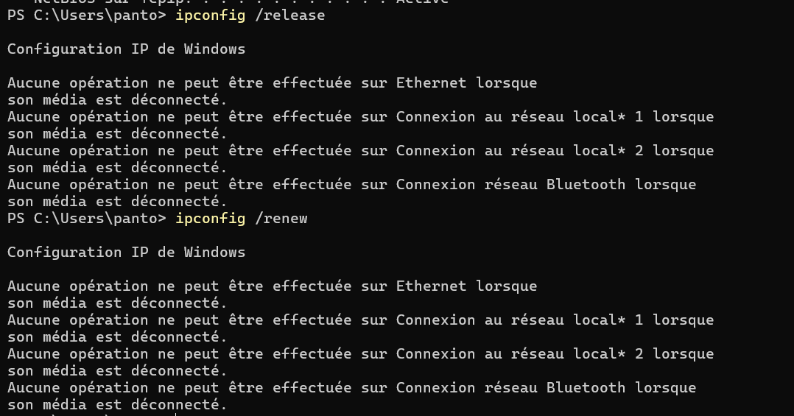

Windows indique qu’aucune opération ne peut être effectuée.
Cela s’explique par le fait que la carte WiFi est configurée en adresse IP statique et ne dépend donc pas du serveur DHCP à ce moment-là.

La commande ipconfig /release ne fonctionne que lorsque l’adresse IP est attribuée dynamiquement par DHCP.

_2) DNS_

Mon serveur DNS est le suivant : 8.8.8.8

Ensuite je fais faire ceci : nslookup google.com et nslookup ynov.com

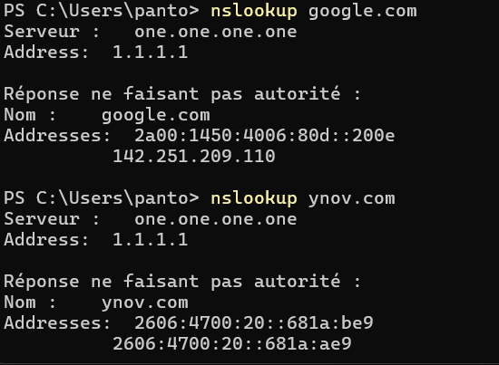

On remarque que le domaine ynov.com utilise plusieurs adresses IP afin d’assurer la disponibilité du service et la répartition de charge via un service comme Cloudflare.

Pour google on remarque que la réponses est "non autoritaire"  car elle provient d'un serveur DNS intermédiaire.

Maintenant reverse lookup

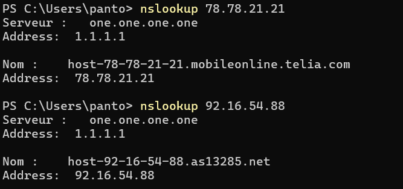
j'ai donc utilisé : nslookup 78.78.21.21
j'ai recu : host-78-78-21-21.mobileonline.telia.com

Le nom de domaine indique qu’il s’agit d’une adresse appartenant à Telia, un fournisseur d’accès Internet.

Le format host-78-78-21-21 montre qu’il s’agit très probablement d’une adresse IP attribuée dynamiquement à un client (connexion mobile ou résidentielle).

ensuite j'ai : nslookup 92.16.54.88
j'ai recu : host-92-16-54-88.as13285.net

Le domaine as13285.net correspond un réseau géré par un opérateur.
Comme pour l’adresse précédente, le nom suggère une IP client.