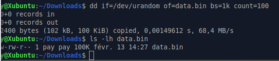
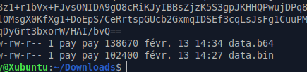
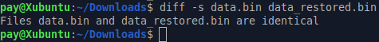
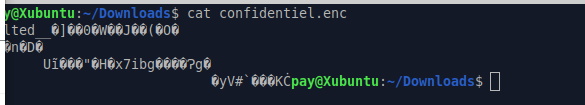
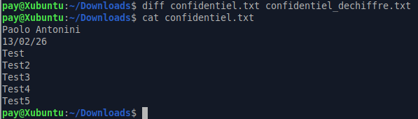
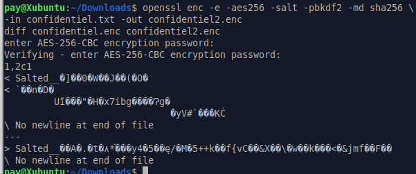
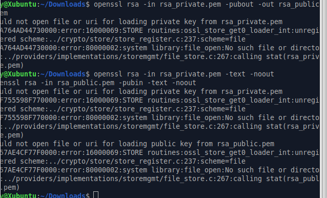
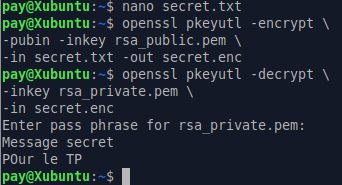
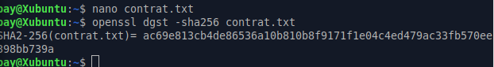
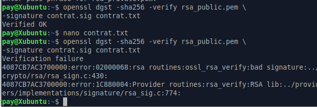

# TP3 - Cryptographie & Sécurité sous Linux

**Auteur :** Paolo Antonini  
**Date :** 13/02/2026

## A. Encodage Base64 

### 1. Génération d'un fichier binaire

Le but est de créer un fichier contenant 100ko de données random donc on utilise cette commande et l'autre pour vérif:

Commande utilisée : `dd if=/dev/urandom of=data.bin bs=1k count=100`  
Vérification : `ls -l data.bin`



### 2. Encodage

On doit maintenant encoder le fichier qu'on a fait dans un fichier data.b64

Commandes utilisées :
```
openssl base64 -e -in data.bin -out data.b64
cat data.b64
ls -l data.bin data.b64
```



### 3. Décodage

Maintenant on doit decoder le fichier data.b64. Pour cela on va taper cette commande :

Commandes utilisées :
```
openssl base64 -d -in data.b64 -out data_restored.bin
diff -s data.bin data_restored.bin
```



### 4. Questions

**1. Base64 est-il un chiffrement ? Pourquoi ?**

Nop c'est pas un chiffrement mais seulement un encodage, car c'est "réversible" donc pas du tout secure

**2. Pourquoi la taille du fichier change-t-elle après encodage ?**

Car ça transforme 3 octets en 4 caractere ASCII

**3. Quel est approximativement le pourcentage d'augmentation ?**

~33%

**4. Quelle méthode permet de vérifier rigoureusement que deux fichiers sont identiques ?**

`sha256sum data.bin data_restored.bin`

## B. Chiffrement symétrique – AES

### 1. Création d'un message

Donc on créer un fichier avec : `nano confidentiel.txt`

Avec comme contenu :
```
Paolo Antonini
13/02/26
Test
Test2
Test3
Test4
Test5
```

### 2. Chiffrement

Maintenant on va le chiffrer avec :
- AES 256
- Un sel
- Une dérivation de clé robuste
- Un algorithme de hachage sécurisé

Commandes utilisées :
```
openssl enc -e -aes256 -salt -pbkdf2 -md sha256 \
-in confidentiel.txt -out confidentiel.enc
cat confidentiel.enc
```



### 3. Déchiffrement

Maintenant on va déchiffrer le fichier vers un .txt, avec cette commande :

Commandes utilisées :
```
openssl enc -d -aes256 -pbkdf2 -md sha256 \
-in confidentiel.enc -out confidentiel_dechiffre.txt
cat confidentiel_dechiffre.txt
```



### 4. Analyse

On doit chiffrer encore le meme fichier avec le meme mdp et les comparé :

Commandes utilisées :
```
openssl enc -e -aes256 -salt -pbkdf2 -md sha256 \
-in confidentiel.txt -out confidentiel2.enc
diff confidentiel.enc confidentiel2.enc
```



### 5. Questions

**1. Pourquoi les deux fichiers chiffrés sont-ils différents ?**

Le sel est random

**2. Quel est le rôle du sel ?**

Empêche les attaques par tables pré-calculées

**3. Que se passe-t-il si une option change lors du déchiffrement ?**

Déchiffrement deviens alors impossible voir corrompu

**4. Pourquoi utilise-t-on PBKDF2 ?**

ça rend les attaques par force brute beaucoup plus lentes

**5. Quelle est la différence entre encodage et chiffrement ?**

L'encodage consiste à transformer des données dans un autre format afin de les rendre plus faciles à stocker, transmettre ou afficher. Il n'apporte aucune sécurité, car il est réversible sans clé.

Tandis que le chiffrement a pour but de protéger les données. Il rend l'information illisible sans une clé secrète, garantissant ainsi la confidentialité du contenu.

## C. Cryptographie asymétrique – RSA 

### 1. Génération de clés

On va alors géné une paire de clés RSA 2048 bits ainsi que la protéger par un chiffrement avec ces commandes et ensuite on l'affiche pour bien vérifier :

Commandes utilisées :
```
openssl genrsa -aes256 -out rsa_private.pem 2048
openssl rsa -in rsa_private.pem -pubout -out rsa_public.pem
openssl rsa -in rsa_private.pem -text -noout
openssl rsa -in rsa_public.pem -pubin -text -noout
```



### 2. Chiffrement asymétrique

Maintenant on va créer un fichier .txt nommé secret, le chiffrer et ensuite déchiffrer celui ci avec la clé privée



### 3. Questions

**1. Pourquoi la clé privée ne doit-elle jamais être partagée ?**

Parce qu'elle permet de déchiffrer les messages et de signer des données. Toute personne possédant la clé privée peut se faire passer pour le propriétaire

**2. Pourquoi RSA n'est-il pas adapté au chiffrement de gros fichiers ?**

RSA est lent et limité en taille de données chiffrables

**3. Quelles différences observe-t-on entre les paramètres d'une clé publique et d'une clé privée ?**

La clé privée contient les nombres premiers et l'exposant privé, contrairement à la clé publique qui ne contient que le modulo et l'exposant public

**4. Quel est le rôle du modulo dans RSA ?**

Le modulo est le produit de deux grands nombres premiers ce qui permet de factorisé le tout ce qui est difficile au niveau mathématique

**5. Pourquoi utilise-t-on souvent RSA pour chiffrer une clé AES plutôt qu'un document entier ?**

Car AES = rapide pour les gros fichiers et RSA = sécurise pour l'échange de clés, ce qui fait un beau combo

## D. Signature numérique 

### 1. Création et signature

On créer un fichier avec : `nano contrat.txt`

On remplis celui ci et on fait la génération de l'empreinte :

Commande utilisée :
```
openssl dgst -sha256 -sign rsa_private.pem \
-out contrat.sig contrat.txt
```



### 2. Vérification

On part vérif la signature avec notre clé publique :

Commande utilisée :
```
openssl dgst -sha256 -verify rsa_public.pem \
-signature contrat.sig contrat.txt
```

Ce qui nous donne : **Verified OK**

Ensuite on va modif le fichier on va rajouter un mot ou un caractère.  
On refait la commande de vérif et cette fois ci on se retrouve avec : **Verification Failure**



### 3. Questions

**1. Que se passe-t-il après modification du fichier ?**

La vérif de la signature échoue

**2. Pourquoi ?**

Parce que la modification du fichier change son empreinte cryptographique (hash) donc la signature correspond plus du tout au contenu

**3. Quel est le rôle du hachage dans le mécanisme de signature ?**

Le hachage permet de garantir :
- A) l'intégrité du document
- B) que le contenu n'a pas été modifié

**4. Quelle différence entre signature numérique et chiffrement ?**

La signature numérique prouve elle l'authenticité et l'intégrité tandis que le chiffrement garantit de son coté la confidentialité

## Bonus (facultatif)

### Chiffrement hybride : AES + RSA

**1. Générer une clé AES aléatoire**

Commande utilisée : `openssl rand -base64 32 > cle_aes.key`

**2. Chiffrement d'un fichier volumineux avec AES**

Commande utilisée :
```
openssl enc -e -aes256 -salt -pbkdf2 -md sha256 \
-in gros_fichier.txt -out gros_fichier.enc
```

**3. Chiffrement de la clé AES avec RSA**

Commande utilisée :
```
openssl pkeyutl -encrypt \
-pubin -inkey rsa_public.pem \
-in cle_aes.key -out cle_aes.enc
```

**4. Expliquer précisément chaque étape**

Dans la première étape on géné une clé AES random de 256 bits, cette clé nous servira à chiffrer le fichier rapidement.

Ensuite en 2ème étape le fichier est chiffré grâce à notre clé, on utilise le sel et le PBKDF2 qui va renforcer la sécurité du chiffrement ce qui nous protège des attaques type bruteforce. Donc on se retrouve avec un fichier binaire ainsi qu'illisible.

Lors de la 3ème étape on chiffre la clé AES qui est une clé sensible avec la clé publique RSA du destinataire, donc seul la clé privée RSA pour déchiffrer la clé AES donc on peut transmettre la clé AES de manière bien sécurisée.

Pour finir on utilise la clé privée RSA pour retrouver la clé AES original une fois la clé AES récup le fichier est enfin déchiffré !
