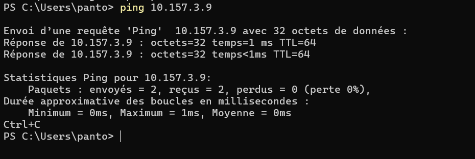

# TP – Administration SSH et Serveur Web Nginx

## Partie 1 – Mise en place de l’environnement virtualisé
Une fois sous bridge, on utilise `ip a` puis on ping depuis Windows notre IP.

Captures d'écran :



```bash
ip a
ping 10.157.3.9
```
C'est juste pour voir si le réseau marche entre la VM et le PC.

## Partie 2 – Serveur SSH
Installation :
```bash
sudo apt update
sudo apt install openssh-server
sudo systemctl status ssh
ss -tulpn | grep ssh
ssh paolo@10.157.3.9
ssh-keygen
ssh-copy-id paolo@10.157.3.9
```
Après ça, plus besoin de taper le mot de passe à chaque fois, c'est trop pratique.

## Partie 3 – Sécurisation SSH

### Modification de la configuration SSH
```bash
sudo nano /etc/ssh/sshd_config
```
Dedans, on change :
Port 2222
PermitRootLogin no
PasswordAuthentication no
PubkeyAuthentication yes

Redémarrage :
```bash
sudo systemctl restart ssh
```
On change le port et on interdit le root et les mots de passe, c'est plus secure.

### Test de connexion
```bash
ssh -p 2222 paolo@10.157.3.9
```
Si ça marche, c'est que la config est bonne.

### Alias SSH
Sur le client :
```bash
nano ~/.ssh/config
```
Host serveur-tp
    HostName 10.157.3.9
    User paolo
    Port 2222
Connexion simplifiée :
```bash
ssh serveur-tp
```
C'est vraiment plus rapide, pas besoin de retenir l'IP ni le port.

## Partie 4 – Transfert de fichiers

### SCP
```bash
scp fichier.txt serveur-tp:/home/paolo/
scp -r mondossier/ serveur-tp:/home/paolo/
```
SCP c'est simple, mais faut bien mettre le chemin.

### SFTP
```bash
sftp serveur-tp
ls
put fichier.txt
get fichier.txt
exit
```
SFTP c'est comme un mini shell pour transférer des fichiers.

### RSYNC
```bash
rsync -avz dossier/ serveur-tp:/home/paolo/dossier/
```
- a pour garder les droits, v pour voir ce qui se passe, z pour compresser.

## Partie 5 – Logs et sécurité

### Surveillance des connexions SSH
```bash
sudo tail -f /var/log/auth.log
```
Pratique pour voir si quelqu'un essaye de se connecter ou brute force.

### Installation de Fail2Ban
```bash
sudo apt install fail2ban
sudo systemctl enable fail2ban
sudo systemctl start fail2ban
sudo fail2ban-client status sshd
```
Si quelqu'un abuse, son IP est bloquée automatiquement.

## Partie 6 – Tunnel SSH

### Tunnel local (accès à un service distant)
```bash
ssh -L 8080:localhost:80 serveur-tp
```
Après, tu vas sur http://localhost:8080 et tu vois le site de la VM.

### Tunnel distant
```bash
ssh -R 2223:localhost:22 serveur-tp
```
Utile si tu veux que le serveur se connecte à ton PC.

## Partie 7 – Nginx et HTTPS

### Installation de Nginx
```bash
sudo apt install nginx
```
Nginx c'est rapide à installer, ça gère bien le HTTPS.

### Création du site
```bash
sudo mkdir /var/www/site-tp
sudo nano /var/www/site-tp/index.html
```
Juste un fichier HTML pour tester.

### Configuration Nginx
```bash
sudo nano /etc/nginx/sites-available/site-tp
```
server {
    listen 80;
    server_name _;
    return 301 https://$host$request_uri;
}

server {
    listen 443 ssl;
    server_name _;

    ssl_certificate /etc/ssl/certs/site-tp.crt;
    ssl_certificate_key /etc/ssl/private/site-tp.key;

    root /var/www/site-tp;
    index index.html;
}
Activation :
```bash
sudo ln -s /etc/nginx/sites-available/site-tp /etc/nginx/sites-enabled/
sudo nginx -t
sudo systemctl reload nginx
```
Ça redirige tout en HTTPS et sert le site.

### Certificat SSL auto-signé
```bash
sudo openssl req -x509 -nodes -days 365 -newkey rsa:2048 \
    -keyout /etc/ssl/private/site-tp.key \
    -out /etc/ssl/certs/site-tp.crt
```
Ça génère un certificat pour le HTTPS, c'est auto-signé donc pas besoin d'acheter.

### Test
```bash
curl -k https://10.157.3.9
```
Si tu vois le HTML, c'est que tout marche.

## Partie 8 – Firewall et permissions

### Firewall UFW
```bash
sudo ufw enable
sudo ufw allow 'Nginx Full'
sudo ufw allow 2222
sudo ufw status
```
Toujours vérifier que les ports sont bien ouverts.

### Permissions
```bash
sudo chown -R www-data:www-data /var/www/site-tp
sudo chmod -R 755 /var/www/site-tp
```
Comme ça, Nginx peut servir les fichiers sans souci.

## Partie 9 – Validation finale

### SSH fonctionnel sur port personnalisé et authentification par clé uniquement
```bash
ss -tulpn | grep ssh
ssh -p 2222 paolo@10.157.3.9
```
Donc si on se connecte dans MDP c'est good

### Fail2Ban actif et opérationnel
```bash
sudo systemctl status fail2ban
sudo fail2ban-client status sshd
```
Le service est "on" donc c'est bon

### Transferts de fichiers fonctionnels (SCP, SFTP, RSYNC)
```bash
scp fichier.txt serveur-tp:/home/paolo/
sftp serveur-tp
rsync -avz dossier/ serveur-tp:/home/paolo/dossier/
```
Ca arrive sur le fichier comme il faut

### Nginx accessible en HTTP et HTTPS avec redirection automatique HTTP → HTTPS
```bash
curl -I http://10.157.3.9
curl -k https://10.157.3.9
```
Tout est clean

### Certificat SSL auto-signé valide
```bash
sudo openssl x509 -in /etc/ssl/certs/site-tp.crt -text -noout
```
On voit le certificat donc nice

### Firewall configuré et permissions correctes sur /var/www/site-tp
```bash
sudo ufw status
ls -ld /var/www/site-tp
ls -l /var/www/site-tp
```
Tout est good :)


