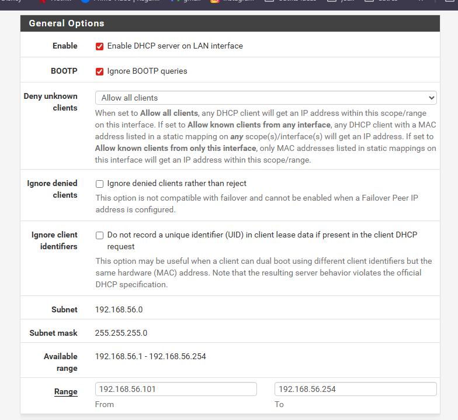
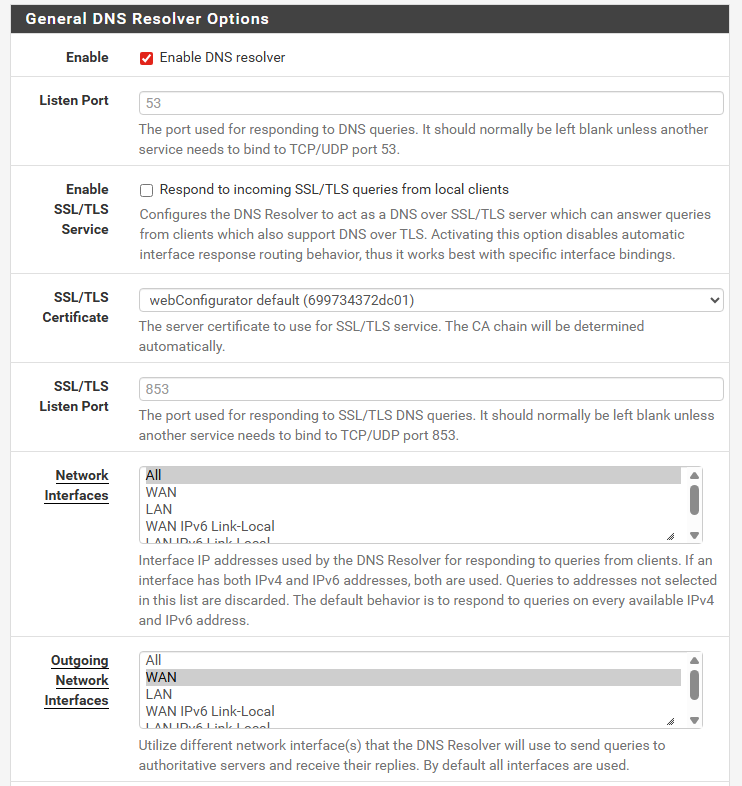
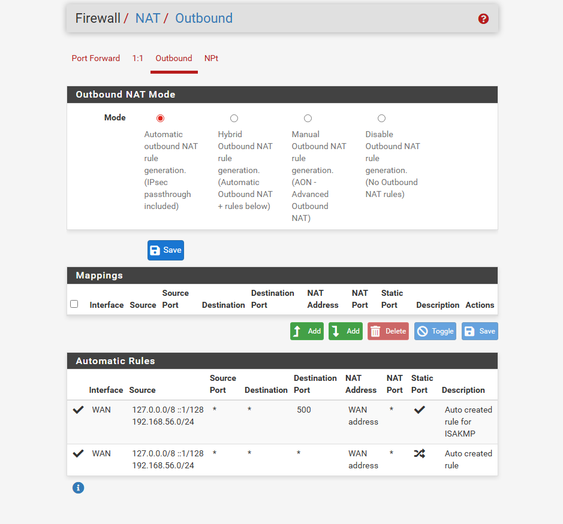
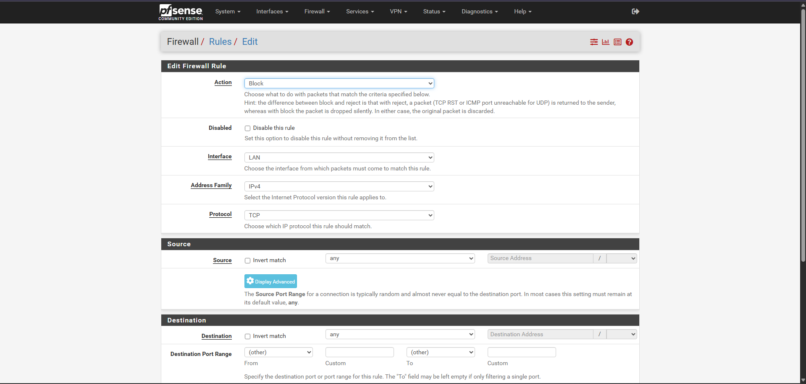
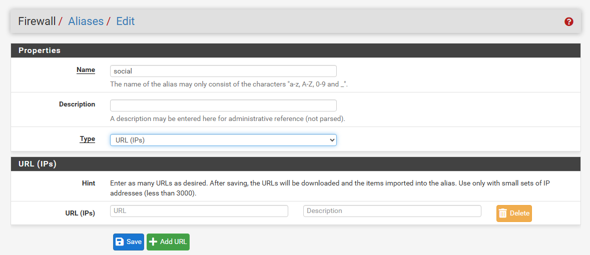
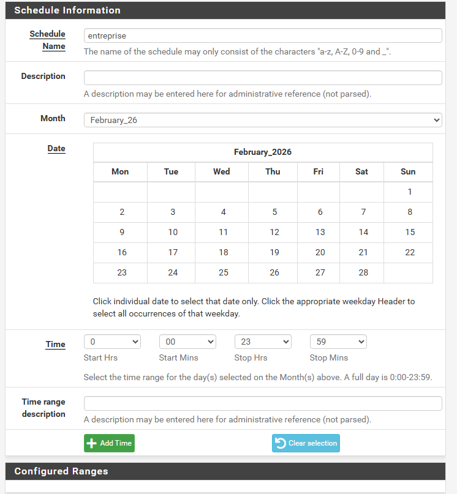
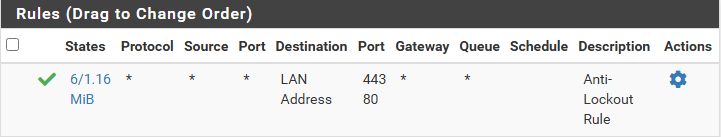
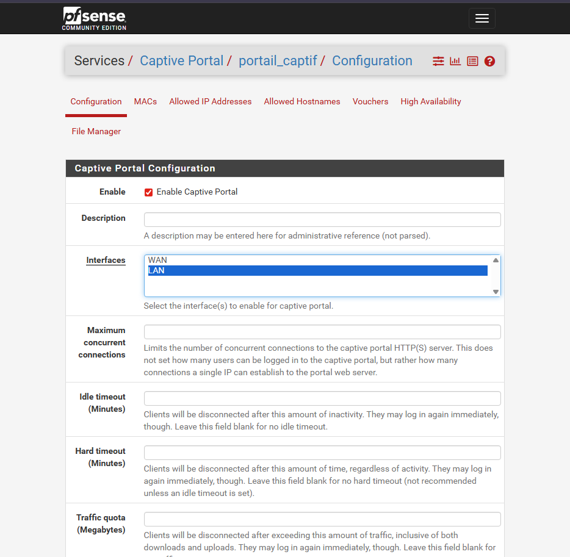
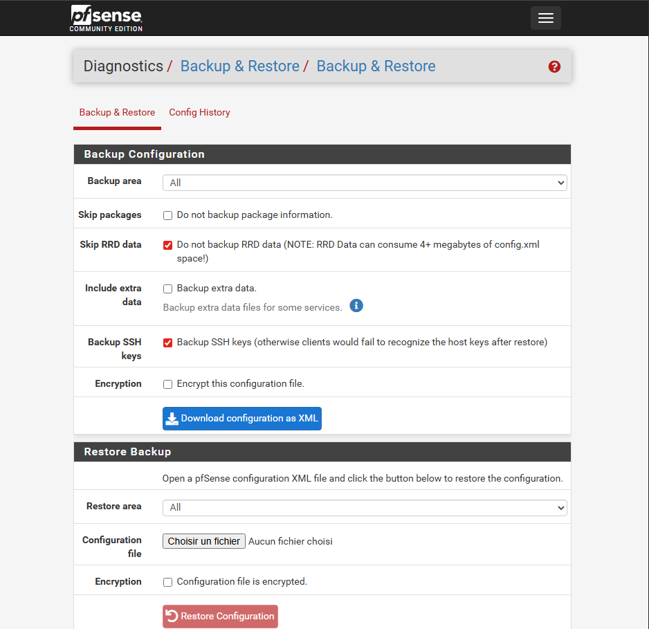

## Partie 1 – Prise en main et sécurisation

### 1. Accès à l'interface

**Questions :**

• Quelle est l’adresse IP du LAN ? → **192.168.56.99**
• Quelle est l’adresse IP du WAN ? → **10.0.2.15**
• Pourquoi utilise-t-on HTTPS ? → Pour sécuriser les échanges entre l'utilisateur et l'interface du pare-feu, en chiffrant les données transmises pour protéger les utilisateurs.
• Pourquoi faut-il changer les identifiants par défaut sur un pare-feu ? → Sinon tout le monde y a accès.

## Partie 2 – Comprendre les interfaces réseau

### 3. Vérification des interfaces

**Questions :**

• Quelle interface permet l’accès Internet ? → le WAN
• Quelle interface correspond au réseau interne ? → le LAN
• Que se passerait-il si les interfaces étaient inversées ? → Le réseau interne serait exposé directement à Internet, ce qui annulerait la protection du pare-feu.
## Partie 3 – Configuration des services réseau

Sur la page **Services/DHCP Server/LAN**
Il suffit de cocher "Enable" pour ajouter le serveur DHCP.

### 4. DHCP

**Questions :**

• Pourquoi utiliser DHCP plutôt qu’une IP fixe ? → Le DHCP permet d'attribuer automatiquement des adresses IP aux appareils du réseau. C'est plus pratique pour les réseaux avec beaucoup d'appareils ou des connexions temporaires.
• Quelle plage d’adresses choisir ? → Il faut choisir une plage d'adresses correspondant au sous-réseau du LAN, par exemple 192.168.56.100 à 192.168.56.200 si le LAN est en 192.168.56.0/24.
• Quelles adresses faut-il éviter d’inclure dans la plage ? → Il faut éviter d'inclure l'adresse du pare-feu, les adresses réservées à des serveurs ou à des équipements configurés en IP fixe, ainsi que l'adresse de broadcast du réseau.
**Vérification :**

Ubuntu obtient-elle automatiquement une adresse IP ? → Je l'ai récupérée avec "ip a"

### 5. DNS

**Questions :**

• Pourquoi un pare-feu peut-il jouer le rôle de serveur DNS ? → Un pare-feu peut jouer le rôle de serveur DNS pour centraliser la résolution des noms dans le réseau local, filtrer les requêtes DNS et améliorer la sécurité en contrôlant les domaines accessibles.
• Que se passe-t-il si le DNS ne fonctionne pas mais que le ping vers 8.8.8.8 fonctionne ? → Cela signifie que la connexion Internet fonctionne, mais la résolution des noms de domaine ne fonctionne pas. On peut accéder aux sites via leur adresse IP, mais pas via leur nom.
## Partie 4 – Autoriser l’accès Internet

### 6. Pare-feu

**Questions :**

• Quelle doit être la source ? → le LAN
• Quelle doit être la destination ? → Any
• Faut-il autoriser tous les protocoles ? → Non, il vaut mieux privilégier les protocoles vraiment nécessaires.
### 7. NAT

Pour le NAT, on va dans **Firewall/Nat/Outbound**
On laisse sur Automatic NAT.

**Questions :**

• Pourquoi le NAT est-il nécessaire avec une interface WAN en NAT ? → Les IP privées LAN ne sont pas routables sur Internet.
• Quelle est la différence entre NAT automatique et manuel ? → Automatique = pfSense gère tout, Manuel = admin configure chaque règle.
• Comment vérifier qu’une traduction d’adresse a lieu ? → Ping IP publique et comparer avec les logs NAT.
## Partie 5 – Filtrage

### 8. Blocage d’un site spécifique

L'alias permet de faire des groupes de sites que l'on souhaite bloquer, par exemple des sites de jeux comme les .io.

**Questions :**

• Pourquoi ne pas créer une règle par site ? → Maintenance difficile
• Où se créent les alias ? → On va dans Firewall/Aliases/Add
• Comment vérifier qu’une règle bloque réellement le trafic ? → Vérifier les logs pfSense.
## Partie 6 – Aller plus loin (partie plus tendue)

### 10. Blocage par catégorie (réseaux sociaux)

J'ai donc créé un alias "social" pour regrouper des sites.

**Questions :**

• Sous une règle “Pass Any” ? → La règle de blocage est ignorée car pfSense lit les règles de haut en bas.
### 11. Règles horaires

Pour créer des horaires, il faut aller : **Firewall → Schedules → Add**
Puis l'appliquer à une règle existante.

**Questions :**

• Pourquoi les règles horaires sont-elles utiles en entreprise ? → Ça permet de contrôler l'accès à certaines heures pour éviter de se connecter en dehors des heures de travail par exemple.
### 12. Serveur web local

On installe Apache/Nginx sur Ubuntu.
Créer une règle LAN → Allow pour IP client spécifique, block pour les autres.

**Questions :**

• Filtrer par IP source ? → On autorise ou bloque selon l’adresse IP de la machine qui fait la demande.
• Filtrer par port ? → On autorise seulement le port utilisé par le service (ex : port 80 ou 443 pour un site web).
• Pourquoi le pare-feu protège-t-il le LAN même en réseau interne ? → Parce qu’un appareil du LAN peut être infecté ou malveillant.
TP5: pfSense

Partie 1 – Prise en main et sécurisation

1. Accès à l'interface

Questions :
Quelle est l’adresse IP du LAN  ? -> 192.168.56.99
Quelle est l’adresse IP du WAN ? -> 10.0.2.15
Pourquoi utilise-t-on HTTPS ? ->  Pour sécuriser les échanges entre l'utilisateur et l'interface du pare-feu, en chiffrant les données transmises pour protéger les utisateurs
Pourquoi utilise-t-on HTTPS ? ->  Pour sécuriser les échanges entre l'utilisateur et l'interface du pare-feu, en chiffrant les données transmises pour protéger les utilisateurs
Pourquoi faut-il changer les identifiants par défaut sur un pare-feu ? -> sinon tout le monde y a acces
Pourquoi faut-il changer les identifiants par défaut sur un pare-feu ? -> sinon tout le monde y a accès

2. Sécurisation de l’accès administrateur :
J'ai changé le mdp pour -> root :)

Questions :
Où se gèrent les utilisateurs ? -> Syetem/User Manager/Users et la bas il y a tout
Où se gèrent les utilisateurs ? -> System/User Manager/Users et là il y a tout
Qu’est-ce qu’un mot de passe robuste ? -> Un mdp robuste assez long, complexe avec des caractere spéciaux et singulié qu'on utilise une fois
Qu’est-ce qu’un mot de passe robuste ? -> Un mot de passe robuste est assez long, complexe, avec des caractères spéciaux et unique qu'on utilise une seule fois
Pourquoi sécuriser en priorité l’accès admin sur un équipement réseau ? -> Car l'admin a acces à tous dont les pare feu
Pourquoi sécuriser en priorité l’accès admin sur un équipement réseau ? -> Car l'admin a accès à tout, y compris les pare-feu

Partie 2 - Comprendre les interfaces réseau

3. Vérification des interfaces

On se rend dans la partie interfaces/Interface Assignments

Questions :
Quelle interface permet l’accès Internet ? le WAN
Quelle interface permet l’accès Internet ? -> le WAN
Quelle interface correspond au réseau interne ? le LAN
Quelle interface correspond au réseau interne ? -> le LAN
Que se passerait-il si les interfaces étaient inversées ? le réseau interne serait exposé directement à Internet, ce qui annulerait la protection du pare-feu
Que se passerait-il si les interfaces étaient inversées ? -> le réseau interne serait exposé directement à Internet, ce qui annulerait la protection du pare-feu

Partie 3 – Configuration des services réseau

Sur la page Services/DHCP Server/LAN
Et on va juste "Enable" pour ajouter le DHCP server 
Et on va juste "Enable" pour ajouter le serveur DHCP

4. DHCP

Scree tp5_1
...existing code...

Questions :
Pourquoi utiliser DHCP plutôt qu’une IP fixe ?
-> Le DHCP permet d'attribuer automatiquement des adresses IP aux appareils du réseau. C'est plus pratique pour les réseaux avec beaucoup d'appareils ou des connexions temporaires.
Quelle plage d’adresses choisir ?
-> Il faut choisir une plage d'adresses correspondant au sous-réseau du LAN, par exemple 192.168.56.100 à 192.168.56.200 si le LAN est en 192.168.56.0/24.
Quelles adresses faut-il éviter d’inclure dans la plage ?
-> Il faut éviter d'inclure l'adresse du pare-feu, les adresses réservées à des serveurs ou à des équipements configurés en IP fixe, ainsi que l'adresse de broadcast du réseau.

Vérification :
Ubuntu obtient-elle automatiquement une adresse IP ? -> je l'ai recup avec "ip a"

5. DNS
voila la config -> screen tp5_3

Questions :
Pourquoi un pare-feu peut-il jouer le rôle de serveur DNS ?
-> Un pare-feu peut jouer le rôle de serveur DNS pour centraliser la résolution des noms dans le réseau local, filtrer les requêtes DNS et améliorer la sécurité en contrôlant les domaines accessibles
Que se passe-t-il si le DNS ne fonctionne pas mais que le ping vers 8.8.8.8 fonctionne ?
-> Cela signifie que la connexion Internet fonctionne, mais la résolution des noms de domaine ne fonctionne pas. On peut accéder aux sites via leur adresse IP, mais pas via leur nom

Partie 4 – Autoriser l’accès Internet 

6. Pare feu
voici les rules -> screen tp5_4

Questions :
Quelle doit être la source ? -> la source doit etre la source LAN 
Quelle doit être la source ? -> la source doit être le LAN
Quelle doit être la destination ? -> la destitaion est Any
Quelle doit être la destination ? -> la destination est Any
Faut-il autoriser tous les protocoles ? -> Nop ce n'est pas prérable, c'est mieux de priviligé  les protocoles vraiment nécéssaires
Faut-il autoriser tous les protocoles ? -> Non, ce n'est pas préférable, il vaut mieux privilégier les protocoles vraiment nécessaires

7. NAT
Pour le nat on va dans Firewall/Nat/Outbound
Pour le NAT on va dans Firewall/Nat/Outbound
On laisse sur Automatic NAT

Questions :
Pourquoi le NAT est-il nécessaire avec une interface WAN en NAT ? -> Les IP privées LAN ne sont pas routables sur Internet
Quelle est la différence entre NAT automatique et manuel ? -> Automatique = pfSense gère tout, Manuel = admin configure chaque règle
Comment vérifier qu’une traduction d’adresse a lieu ? -> Ping IP publique et comparer avec logs NAT

Partie 5 – Filtrage
8. Blocage d’un site spécifique

L'alias permet de faire des groupes de sites que l'on souhaite bloquer type site de jeu comme les .io
L'alias permet de faire des groupes de sites que l'on souhaite bloquer, par exemple des sites de jeux comme les .io
Pourquoi ne pas créer une règle par site ? Maintenance difficile
Pourquoi ne pas créer une règle par site ? -> Maintenance difficile
Où se créent les alias ? -> on va dans Firewall/Aliases/Add
Où se créent les alias ? -> On va dans Firewall/Aliases/Add
Comment vérifier qu’une règle bloque réellement le trafic ? -> Logs pfSense
Comment vérifier qu’une règle bloque réellement le trafic ? -> Vérifier les logs pfSense

Partie 6 – Aller plus loin (partie plus tendue)

10. Blocage par catégorie (réseaux sociaux)

J'ai donc créer une un alias social pour créer des groupes de sites
J'ai donc créé un alias "social" pour regrouper des sites
Sous une règle “Pass Any” ? → La règle de blocage est ignorée car pfSense lit les règles de haut en bas

11. Règles horaires
Pour créer des horraires il faut allez : Firewall → Schedules → Add
Pour créer des horaires il faut aller : Firewall → Schedules → Add
Ainsi que l'appliqué à règle existante 
Ainsi que l'appliquer à une règle existante

Pourquoi les règles horaires sont-elles utiles en entreprise ?
ça permet de controlé l'accès à certaines heures pour pas se connecté en dehors des heures de travail par exemple
Ça permet de contrôler l'accès à certaines heures pour éviter de se connecter en dehors des heures de travail par exemple

12. Serveur web local
On installe Apache/Nginx sur Ubuntu
Crée une règle LAN → Allow pour IP client spécifique block pour les autres
Créer une règle LAN → Allow pour IP client spécifique, block pour les autres
Vérifie filtrage par IP et port (80/443)
Vérifier le filtrage par IP et port (80/443)

Filtrer par IP source ? -> On autorise ou bloque selon l’adresse IP de la machine qui fait la demande
Filtrer par port ? -> On autorise seulement le port utilisé par le service (ex : port 80 ou 443 pour un site web)
Pourquoi le pare-feu protège-t-il le LAN même en réseau interne ? -> Parce qu’un appareil du LAN peut être infecté ou malveillant

15. Filtrage MAC

Donc on va au menu firewall -> rules -> lan est on met dans les sources Source MAC
Donc on va au menu firewall -> rules -> lan et on met dans les sources "Source MAC"

le filtrage MAC est-il réellement sécurisé ? -> le filtrage mac est peu sécurisé
Le filtrage MAC est-il réellement sécurisé ? -> Le filtrage MAC est peu sécurisé
Pourquoi est-il facilement contournable ? -> car le mac est spoofable
Pourquoi est-il facilement contournable ? -> Car le MAC est spoofable

16. Portail captif
On va dans services -> captive portal et on configure

Question :
Dans quels contextes utilise-t-on cela ? -> utilisation comme Wi-Fi invité, hôtels, écoles
Quelle(s) avantage(s) avec une simple règle de pare-feu ? -> Avantage = Auth centralisée + journalisation

17. Sauvegarde / restauration
il faut allez dans Diagnostics/back et restore
Il faut aller dans Diagnostics/Backup and Restore

Pourquoi la sauvegarde régulière est-elle essentielle en production ? -> Sauvegarde essentielle ça permet restauration rapide en cas de problème réduit downtime
Pourquoi la sauvegarde régulière est-elle essentielle en production ? -> La sauvegarde est essentielle, elle permet une restauration rapide en cas de problème et réduit le downtime