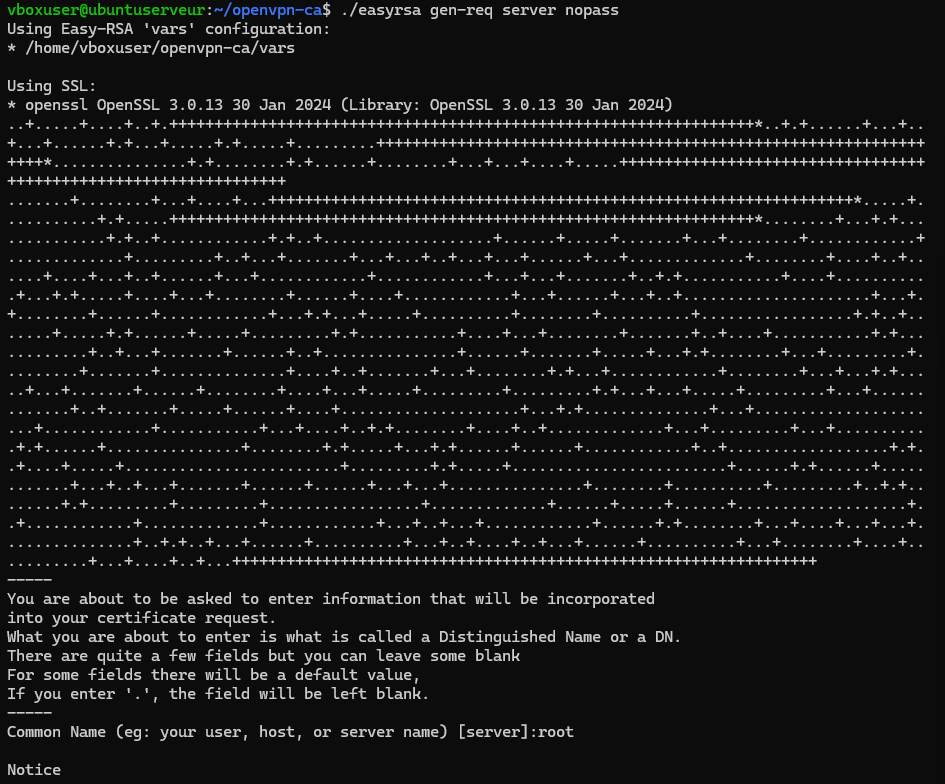
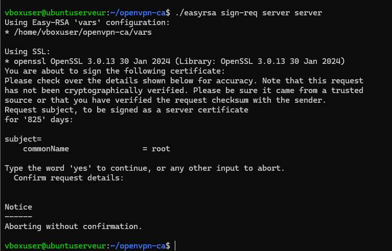
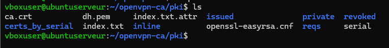
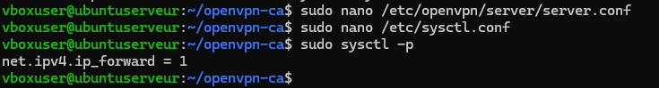
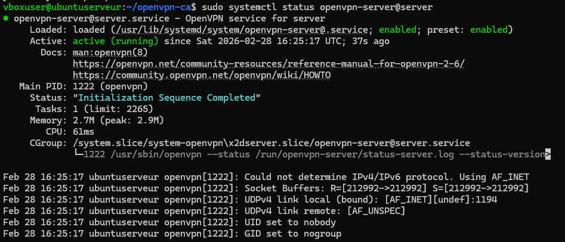
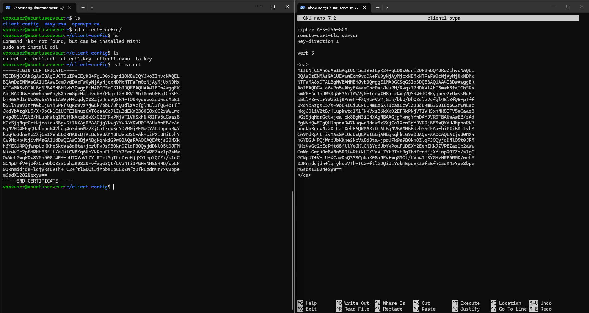
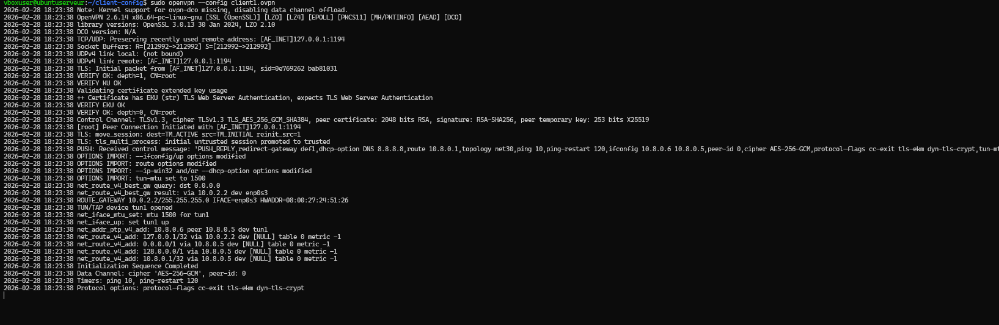
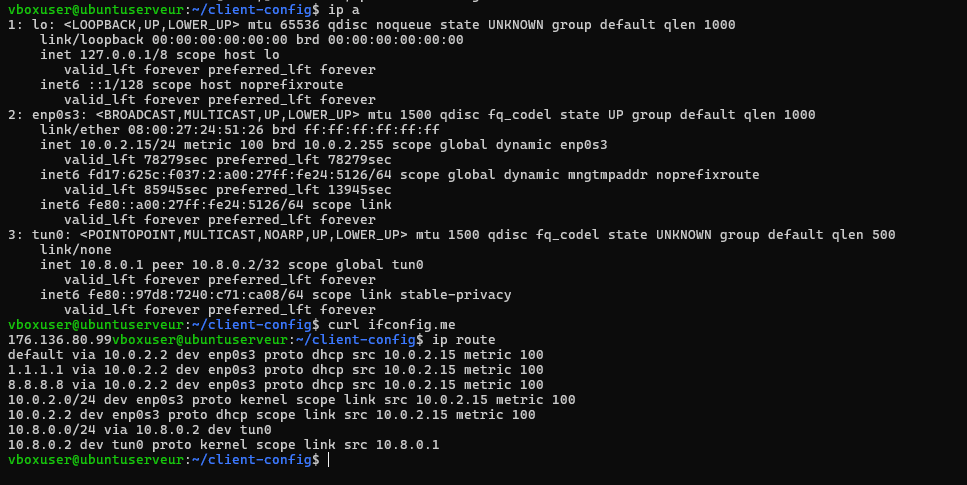

**TP -- Mise en place d'un serveur OpenVPN sur Ubuntu Server**

**Partie 1 : Comprendre la PKI**

**Questions**

À quoi sert une autorité de certification (CA) ? -> Une CA permet de signer et vérifier l’identité des certificats.
Dans un VPN, elle garantit que seuls les clients autorisés peuvent se connecter.

Quelle différence entre clé privée et certificat ? -> Clé privée : secrète, sert à prouver son identité
Certificat : public, signé par la CA, prouve que la clé est légitime

Pourquoi un serveur VPN a-t-il besoin de certificats ? pour : 
- Chiffrer les communications
- Authentifier serveur et clients
- Empêcher les connexions non autorisées

Création de l'infrastructure Easy-RSA

On créer notre environnement -> 
>> mkdir ~/openvpn-ca
>> cd ~/openvpn-ca 
>> ./easyrsa init-pki

Quand on ls alors on se retrouve avec notre environnement

screen tp6_1.png

**Maintenant notre but est de générer :**
- une CA
- un certificat serveur
- un certificat client
- les settings Diffie-Hellman
- une clé TLS

Pour la CA ->
>> ./easyrsa build-ca
screen tp6_1.png

Pour le certif serveur et client ->
>> ./easyrsa gen-req server nopass
>> ./easyrsa sign-req server server
screen tp6_3.png
screen tp6_4.png

>> ./easyrsa gen-req client1 nopass
>> ./easyrsa sign-req client client1
je ne remet pas de screen ça ressemble un peu à la meme choses

Pour les settings ->
>> ./easyrsa gen-dh
screen tp6_5.png

Pour la clé TLS ->
>> openvpn --genkey secret ta.key
>> openvpn --genkey tls-crypt-v2-server tc.key
screen tp6_6.png

Où Easy-RSA crée-t-il ses fichiers ? -> Easy-RSA crée ses fichiers dans le dossier pki/ situé dans le répertoire où l’on a initialisé

Que contient le dossier pki/ ?
Le dossier pki/ contient toute l’infrastructure de certificats :
le certificat de la CA (ca.crt)
- les clés privées (private/)
- les certificats signés (issued/)
- les demandes de certificats (reqs/)
- les paramètres Diffie-Hellman (dh.pem)
- éventuellement la liste de révocation (crl.pem)

Quelle est la différence entre gen-req et sign-req ? -> 
gen-req génère une demande de certificat et une clé privée.
sign-req signe cette demande avec la CA pour produire un certificat valide.

Que se passe-t-il si vous oubliez de signer un certificat ? -> Le certificat ne sera pas valide. Le serveur ou le client VPN ne pourra pas s’authentifier et la connexion échouera.

Partie 2 : Configuration du serveur OpenVPN

Donc on créer un fichier de config :
Pour ça on créer le fichier du serveur :
>> sudo mkdir -p /etc/openvpn/server

une fois ça fait on doit : afin de copier 
>> sudo cp pki/ca.crt \
pki/issued/server.crt \
pki/private/server.key \
pki/dh.pem \
ta.key \
/etc/openvpn/server/

On fait le fichier server.conf et on met ça dedans 
>> 
port 1194
proto udp
dev tun

ca ca.crt
cert server.crt
key server.key
dh dh.pem
tls-auth ta.key 0

server 10.8.0.0 255.255.255.0

push "redirect-gateway def1"
push "dhcp-option DNS 8.8.8.8"

keepalive 10 120
cipher AES-256-GCM
persist-key
persist-tun
user nobody
group nogroup
verb 3

il y a donc maintenant :
**Il y a donc maintenant :**
- **Port d’écoute :** 1194 (port par défaut d’OpenVPN)
- **Protocole :** udp
- **Interface virtuelle :** dev tun
- **Réseau attribué aux clients :** 10.8.0.0 255.255.255.0
- **Certificats et clés :** ca.crt, server.crt, server.key, dh.pem, ta.key
- **Options de routage :** redirection de la passerelle par défaut
- **Chiffrement :** AES-256-GCM

Questions: 
- que signifie dev tun ? >> La directive dev tun indique que le serveur utilise une interface virtuelle de type TUN elle marche au niveau 3 du modele OSI
- Quelle est la différence entre UDP et TCP pour un VPN ? >> UDP (User Datagram Protocol) :
Plus rapide
Moins de latence
Moins de surcharge
Recommandé pour les VPN

>> TCP (Transmission Control Protocol) :
Plus fiable (contrôle d’erreurs)
Plus lent
Peut provoquer une double encapsulation TCP (moins performant)

- Quelle plage IP choisir pour le VPN ? Pourquoi ? >> "10.8.0.0 /24" - car c'est une adresse privée et indé du réseau local

Suite du partie 2 :

On doit activer le forwarding et mettre le nat
suite à ça on active le forwading IP :
Pour ça on fait :
>> sudo nano /etc/sysctl.conf
**On rajoute cette ligne :**
>> net.ipv4.ip_forward=1
et on l'active :
>> sudo sysctl -p
screen tp6_7.png

Et on rajoute la regle nat avec iptables 
et donc la regle permet de masque l'adresse ip des clients vpn par l'adresse du serveur la publique

Questions :
- Où se configure le paramètre ip_forward ? >> dans ton fichier /etc/sysctl.conf
- Quelle commande permet d'afficher les règles NAT actuelles ? >> sudo iptables -t nat -L
- Pourquoi faut-il "masquerader" le réseau VPN ? >> 
Le MASQUERADE permet :

De remplacer l’adresse IP privée des clients VPN par 
- l’adresse IP du serveur
- De permettre aux clients VPN d’accéder à Internet
- De garantir que les réponses des serveurs Internet reviennent vers le serveur VPN

On lance le serveur : et voila ce que ça donne :) avec 
>> sudo systemctl status openvpn-server@server
screen tp6_8.png

Si le service échoue :
- Quelle commande permet d'afficher les logs système d'un service ? >> sudo journalctl -u openvpn-server@server
- Quelle est la différence entre status et journalctl ? >> le status affiche seulement l'état actuel du service tandis que le journal il permet d'accédé à un vrai historique complet
- Les chemins vers les certificats sont-ils corrects ? ils sont à /etc/openvpn/server/

Partie 3 : Création du profil client

Donc on créer .ovpn
donc nano client1.ovpn
et on va le remplir
en allant chercher tous les certificats dans tous les fichiers nécessaires
par exemple celui ci..
screen tp6_9.png

Une fois avoir recup :
>> le certif ca
>> le certif client
>> clé privée
>> authentification TLS

On garde bien sur le debut de la config avec l'adresse en 127.0.0.1
et les settings

Questions :
Comment intégrer un certificat directement dans un fichier .ovpn ? >> On les encadres par des balises comme en html avec <ca>...</ca>, <cert>...</cert>, <key>...</key>

Pourquoi la clé privée ne doit-elle jamais être partagée
publiquement ? >> Elle permet de déchiffrer tout le trafic et d'usurper l'identité du client et si quelqu'un la possede elle peut potentiellement usurpé notre identétié sur le VPN

**Maintenant, go valider notre connexion**
screen tp6_10

sudo openvpn --config ~/client-config/client1.ovpn

et voila l'adresse vérifié et l'acces internet via tunnel !!
>> ip a 
on le remarque avec :
>> tun1
>> inet 10.8.0.6

et le trafic :
>> curl ifconfig.me
et pour finir la route :
>> ip route
screen tp6_11

Questions :
Comment vérifier que votre trafic passe par le VPN ? >> Vérifier que son IP publique a changé et que la route par défaut pointe vers le tunnel
Que se passe-t-il si le port 1194 est bloqué ? >> La connexion OpenVPN échoue tout simplement